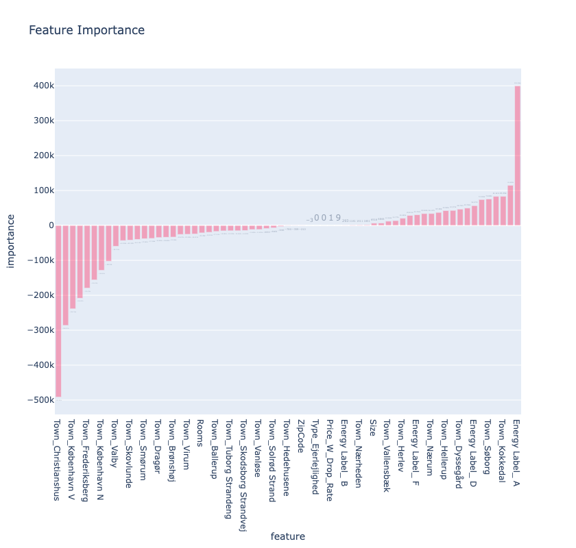

# Data in the Wild: Wrangling and Visualising Data (Autumn 2022)
Data in the Wild: Wrangling and Visualising Data -Project

#Group project

It's a repository supporting the report for the course : "Data in the Wild: Wrangling and Visualising Data (Autumn 2022)".

## **[The Report link here](https://www.overleaf.com/project/636b903a7239d73c69839d31 "Overleaf link")**.

## Dataset

--> Data Sources:

### Data source 1: **[Boliga](https://www.boliga.dk/ "Data source 1")**

### Data source 2: **[Boligsiden](https://www.boligsiden.dk/ "Data source 2")**

## Data Gathering

The scraper scripts use Selenium to crawl on their given sites, boligsiden.dk and boliga.dk.
Each script loads a list of zip codes which are stored in csv files, cph_zip.csv contains all the zip codes inside Copenhagen, while cph_zip_extended.csv contains all the zip codes for the area of Greater Copenhagen. They have been divided into two parts in order to make scraping more feasible in terms of running time, therefore it is recommended to use only one at a time, otherwise running time could be more than 6 hours.
Each script creates a list of urls to be looked at for the given zip codes and every zip code is ran individually, where all the url for the houses of the given zip code are being saved into another list.
After the list is finished and all zip codes have been checked, all houses have been added to the list, the scrape function is initialized for the houses.
The scrape opens the url for each house and saves their respective information into a dataframe.
The scraped information are the following:

'Type', 'Address', 'Price', 'Sqm Price', 'Size', 'Living Area', 'Ground Area', 'Rooms', 'Ownership Expense', 'Year Built', 'Story', 'Energy Label', 'Description' 

Once all the houses have been scraped, their address is cleaned and their coordinates are extracted with Nominatim geolocator with the cleaned address.

The output is a csv file.

## Feature Importance

